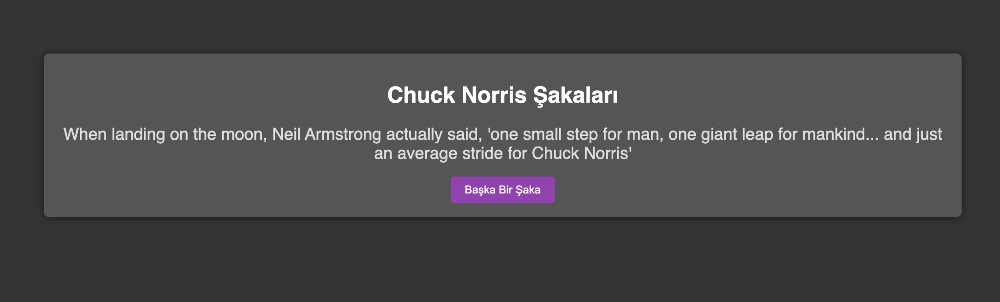

# Chuck Norris Şakaları (API)

Bu proje, **Chuck Norris Joke API** kullanarak rastgele şaka gösteren basit bir web uygulamasıdır.

## Özellikler
- Sayfa açılınca otomatik şaka getirir
- **“Başka Bir Şaka”** butonuna tıklayınca yeni şaka getirir
- Hata durumunda kullanıcıya mesaj gösterir

## Kullanılan API
- `https://api.chucknorris.io/jokes/random`

## Dosya Yapısı
- `index.html`
- `style.css`
- `app.js`
- `screenshot.png`

## Local Çalıştırma
1. ZIP’i çıkarın.
2. `index.html` dosyasını çift tıklayıp tarayıcıda açın.
3. Şaka gelmiyorsa internet bağlantınızı kontrol edin (API çağrısı var).

## GitHub Pages ile Canlı Yayınlama
1. Projeyi GitHub reposuna yükleyin (**index.html root'ta olmalı**).
2. Repo → **Settings** → **Pages**
3. Source: **Deploy from a branch**
4. Branch: **main** / folder: **/(root)** → Save
5. Canlı link şu formatta olur:
   - `https://KULLANICI_ADI.github.io/REPO_ADI/`

### Canlı Site
[Proje Adı](https://github-username.github.io/repository-name)

### Proje Ekran Görüntüsü

